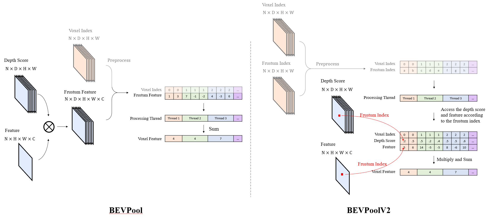
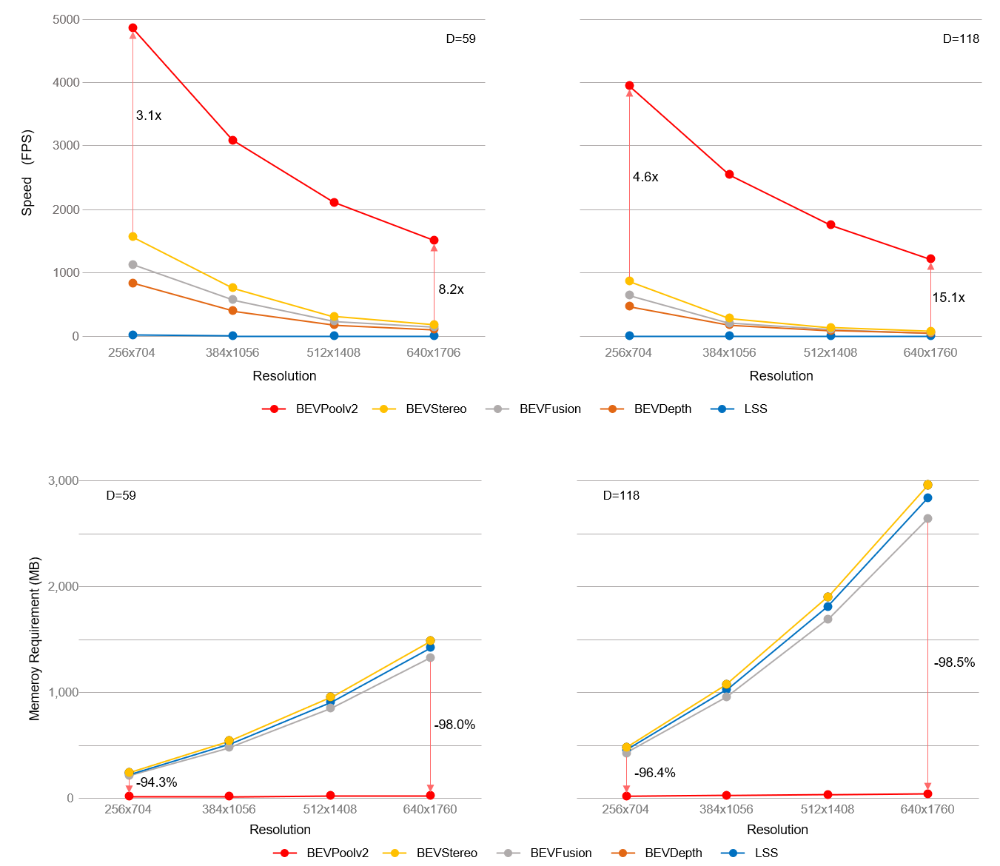

<div align="center">
  
  <div>&nbsp;</div>
  <div align="center">
    <b><font size="5">OpenMMLab website</font></b>
    <sup>
      <a href="https://openmmlab.com">
        <i><font size="4">HOT</font></i>
      </a>
    </sup>
    &nbsp;&nbsp;&nbsp;&nbsp;
    <b><font size="5">OpenMMLab platform</font></b>
    <sup>
      <a href="https://platform.openmmlab.com">
        <i><font size="4">TRY IT OUT</font></i>
      </a>
    </sup>
  </div>
  <div>&nbsp;</div>
</div>

[](https://mmdetection3d.readthedocs.io/en/latest/)
[](https://github.com/open-mmlab/mmdetection3d/actions)
[](https://codecov.io/gh/open-mmlab/mmdetection3d)
[](https://github.com/open-mmlab/mmdetection3d/blob/master/LICENSE)

**News**: We released the codebase v1.0.0rc4.

Note: We are going through large refactoring to provide simpler and more unified usage of many modules.

The compatibilities of models are broken due to the unification and simplification of coordinate systems. For now, most models are benchmarked with similar performance, though few models are still being benchmarked. In this version, we update some of the model checkpoints after the refactor of coordinate systems. See more details in the [Changelog](docs/en/changelog.md).

In the [nuScenes 3D detection challenge](https://www.nuscenes.org/object-detection?externalData=all&mapData=all&modalities=Any) of the 5th AI Driving Olympics in NeurIPS 2020, we obtained the best PKL award and the second runner-up by multi-modality entry, and the best vision-only results.

Code and models for the best vision-only method, [FCOS3D](https://arxiv.org/abs/2104.10956), have been released. Please stay tuned for [MoCa](https://arxiv.org/abs/2012.12741).

MMDeploy has supported some MMDetection3d model deployment.

Documentation: https://mmdetection3d.readthedocs.io/

## Introduction

English | [简体中文](README_zh-CN.md)

The master branch works with **PyTorch 1.3+**.

MMDetection3D is an open source object detection toolbox based on PyTorch, towards the next-generation platform for general 3D detection. It is
a part of the OpenMMLab project developed by [MMLab](http://mmlab.ie.cuhk.edu.hk/).


### Major features

- **Support multi-modality/single-modality detectors out of box**

  It directly supports multi-modality/single-modality detectors including MVXNet, VoteNet, PointPillars, etc.

- **Support indoor/outdoor 3D detection out of box**

  It directly supports popular indoor and outdoor 3D detection datasets, including ScanNet, SUNRGB-D, Waymo, nuScenes, Lyft, and KITTI.
  For nuScenes dataset, we also support [nuImages dataset](https://github.com/open-mmlab/mmdetection3d/tree/master/configs/nuimages).

- **Natural integration with 2D detection**

  All the about **300+ models, methods of 40+ papers**, and modules supported in [MMDetection](https://github.com/open-mmlab/mmdetection/blob/master/docs/en/model_zoo.md) can be trained or used in this codebase.

- **High efficiency**

  It trains faster than other codebases. The main results are as below. Details can be found in [benchmark.md](./docs/en/benchmarks.md). We compare the number of samples trained per second (the higher, the better). The models that are not supported by other codebases are marked by `✗`.

  |       Methods       | MMDetection3D | [OpenPCDet](https://github.com/open-mmlab/OpenPCDet) | [votenet](https://github.com/facebookresearch/votenet) | [Det3D](https://github.com/poodarchu/Det3D) |
  | :-----------------: | :-----------: | :--------------------------------------------------: | :----------------------------------------------------: | :-----------------------------------------: |
  |       VoteNet       |      358      |                          ✗                           |                           77                           |                      ✗                      |
  |  PointPillars-car   |      141      |                          ✗                           |                           ✗                            |                     140                     |
  | PointPillars-3class |      107      |                          44                          |                           ✗                            |                      ✗                      |
  |       SECOND        |      40       |                          30                          |                           ✗                            |                      ✗                      |
  |       Part-A2       |      17       |                          14                          |                           ✗                            |                      ✗                      |

Like [MMDetection](https://github.com/open-mmlab/mmdetection) and [MMCV](https://github.com/open-mmlab/mmcv), MMDetection3D can also be used as a library to support different projects on top of it.

## License

This project is released under the [Apache 2.0 license](LICENSE).

## Changelog

v1.0.0rc4 was released in 8/8/2022.

- Support [FCAF3D](https://arxiv.org/pdf/2112.00322.pdf)

Please refer to [changelog.md](docs/en/changelog.md) for details and release history.

## Benchmark and model zoo

Results and models are available in the [model zoo](docs/en/model_zoo.md).

<div align="center">
  <b>Components</b>
</div>
<table align="center">
  <tbody>
    <tr align="center" valign="bottom">
      <td>
        <b>Backbones</b>
      </td>
      <td>
        <b>Heads</b>
      </td>
      <td>
        <b>Features</b>
      </td>
    </tr>
    <tr valign="top">
      <td>
      <ul>
        <li><a href="configs/pointnet2">PointNet (CVPR'2017)</a></li>
        <li><a href="configs/pointnet2">PointNet++ (NeurIPS'2017)</a></li>
        <li><a href="configs/regnet">RegNet (CVPR'2020)</a></li>
        <li><a href="configs/dgcnn">DGCNN (TOG'2019)</a></li>
        <li>DLA (CVPR'2018)</li>
        <li>MinkResNet (CVPR'2019)</li>
      </ul>
      </td>
      <td>
      <ul>
        <li><a href="configs/free_anchor">FreeAnchor (NeurIPS'2019)</a></li>
      </ul>
      </td>
      <td>
      <ul>
        <li><a href="configs/dynamic_voxelization">Dynamic Voxelization (CoRL'2019)</a></li>
      </ul>
      </td>
    </tr>
  </tbody>
</table>

<div align="center">
  <b>Architectures</b>
</div>
<table align="center">
  <tbody>
    <tr align="center" valign="middle">
      <td>
        <b>3D Object Detection</b>
      </td>
      <td>
        <b>Monocular 3D Object Detection</b>
      </td>
      <td>
        <b>Multi-modal 3D Object Detection</b>
      </td>
      <td>
        <b>3D Semantic Segmentation</b>
      </td>
    </tr>
    <tr valign="top">
      <td>
        <li><b>Outdoor</b></li>
        <ul>
            <li><a href="configs/second">SECOND (Sensor'2018)</a></li>
            <li><a href="configs/pointpillars">PointPillars (CVPR'2019)</a></li>
            <li><a href="configs/ssn">SSN (ECCV'2020)</a></li>
            <li><a href="configs/3dssd">3DSSD (CVPR'2020)</a></li>
            <li><a href="configs/sassd">SA-SSD (CVPR'2020)</a></li>
            <li><a href="configs/point_rcnn">PointRCNN (CVPR'2019)</a></li>
            <li><a href="configs/parta2">Part-A2 (TPAMI'2020)</a></li>
            <li><a href="configs/centerpoint">CenterPoint (CVPR'2021)</a></li>
        </ul>
        <li><b>Indoor</b></li>
        <ul>
            <li><a href="configs/votenet">VoteNet (ICCV'2019)</a></li>
            <li><a href="configs/h3dnet">H3DNet (ECCV'2020)</a></li>
            <li><a href="configs/groupfree3d">Group-Free-3D (ICCV'2021)</a></li>
            <li><a href="configs/fcaf3d">FCAF3D (ECCV'2022)</a></li>
      </ul>
      </td>
      <td>
        <li><b>Outdoor</b></li>
        <ul>
          <li><a href="configs/imvoxelnet">ImVoxelNet (WACV'2022)</a></li>
          <li><a href="configs/smoke">SMOKE (CVPRW'2020)</a></li>
          <li><a href="configs/fcos3d">FCOS3D (ICCVW'2021)</a></li>
          <li><a href="configs/pgd">PGD (CoRL'2021)</a></li>
          <li><a href="configs/monoflex">MonoFlex (CVPR'2021)</a></li>
        </ul>
      </td>
      <td>
        <li><b>Outdoor</b></li>
        <ul>
          <li><a href="configs/mvxnet">MVXNet (ICRA'2019)</a></li>
        </ul>
        <li><b>Indoor</b></li>
        <ul>
          <li><a href="configs/imvotenet">ImVoteNet (CVPR'2020)</a></li>
        </ul>
      </td>
      <td>
        <li><b>Indoor</b></li>
        <ul>
          <li><a href="configs/pointnet2">PointNet++ (NeurIPS'2017)</a></li>
          <li><a href="configs/paconv">PAConv (CVPR'2021)</a></li>
          <li><a href="configs/dgcnn">DGCNN (TOG'2019)</a></li>
        </ul>
      </ul>
      </td>
    </tr>
</td>
    </tr>
  </tbody>
</table>

|               | ResNet | PointNet++ | SECOND | DGCNN | RegNetX | DLA | MinkResNet |
| :-----------: | :----: | :--------: | :----: | :---: | :-----: | :-: | :--------: |
|    SECOND     |   ✗    |     ✗      |   ✓    |   ✗   |    ✗    |  ✗  |     ✗      |
| PointPillars  |   ✗    |     ✗      |   ✓    |   ✗   |    ✓    |  ✗  |     ✗      |
|  FreeAnchor   |   ✗    |     ✗      |   ✗    |   ✗   |    ✓    |  ✗  |     ✗      |
|    VoteNet    |   ✗    |     ✓      |   ✗    |   ✗   |    ✗    |  ✗  |     ✗      |
|    H3DNet     |   ✗    |     ✓      |   ✗    |   ✗   |    ✗    |  ✗  |     ✗      |
|     3DSSD     |   ✗    |     ✓      |   ✗    |   ✗   |    ✗    |  ✗  |     ✗      |
|    Part-A2    |   ✗    |     ✗      |   ✓    |   ✗   |    ✗    |  ✗  |     ✗      |
|    MVXNet     |   ✓    |     ✗      |   ✓    |   ✗   |    ✗    |  ✗  |     ✗      |
|  CenterPoint  |   ✗    |     ✗      |   ✓    |   ✗   |    ✗    |  ✗  |     ✗      |
|      SSN      |   ✗    |     ✗      |   ✗    |   ✗   |    ✓    |  ✗  |     ✗      |
|   ImVoteNet   |   ✓    |     ✓      |   ✗    |   ✗   |    ✗    |  ✗  |     ✗      |
|    FCOS3D     |   ✓    |     ✗      |   ✗    |   ✗   |    ✗    |  ✗  |     ✗      |
|  PointNet++   |   ✗    |     ✓      |   ✗    |   ✗   |    ✗    |  ✗  |     ✗      |
| Group-Free-3D |   ✗    |     ✓      |   ✗    |   ✗   |    ✗    |  ✗  |     ✗      |
|  ImVoxelNet   |   ✓    |     ✗      |   ✗    |   ✗   |    ✗    |  ✗  |     ✗      |
|    PAConv     |   ✗    |     ✓      |   ✗    |   ✗   |    ✗    |  ✗  |     ✗      |
|     DGCNN     |   ✗    |     ✗      |   ✗    |   ✓   |    ✗    |  ✗  |     ✗      |
|     SMOKE     |   ✗    |     ✗      |   ✗    |   ✗   |    ✗    |  ✓  |     ✗      |
|      PGD      |   ✓    |     ✗      |   ✗    |   ✗   |    ✗    |  ✗  |     ✗      |
|   MonoFlex    |   ✗    |     ✗      |   ✗    |   ✗   |    ✗    |  ✓  |     ✗      |
|    SA-SSD     |   ✗    |     ✗      |   ✓    |   ✗   |    ✗    |  ✗  |     ✗      |
|    FCAF3D     |   ✗    |     ✗      |   ✗    |   ✗   |    ✗    |  ✗  |     ✓      |

**Note:** All the about **300+ models, methods of 40+ papers** in 2D detection supported by [MMDetection](https://github.com/open-mmlab/mmdetection/blob/master/docs/en/model_zoo.md) can be trained or used in this codebase.

## Installation

Please refer to [getting_started.md](docs/en/getting_started.md) for installation.
# BEVDet


 
 
## News
* **2022.11.24** A new branch of bevdet codebase, dubbed dev2.0, is released. dev2.0 includes the following features:
1. support **BEVPoolv2**, whose inference speed is up to **15.1 times** the previous fastest implementation of Lift-Splat-Shoot view transformer. It is also far less memory consumption.
 
 
2. use the origin of ego coordinate system as the center of the receptive field instead of the Lidar's.
3. **support conversion of BEVDet from pytorch to TensorRT.**
4. use the long term temporal fusion as SOLOFusion.
5. train models without CBGS by default.
6. use key frame for temporal fusion.

* [History](./docs/en/news.md)


## Main Results
| Config            | mAP      | NDS     | FPS     |   Model | Log
|--------|----------|---------|--------|-------------|-------|
| [**BEVDet-R50**](configs/bevdet/bevdet-r50.py)       | 27.8     | 32.2    | 18.7    | [google](https://drive.google.com/drive/folders/1Dh2FbEChbfhIaBHimPP4jbibs8XjJ5rx?usp=sharing)   | [google](https://drive.google.com/drive/folders/1Dh2FbEChbfhIaBHimPP4jbibs8XjJ5rx?usp=sharing) 
| [**BEVDet-R50-CBGS**](configs/bevdet/bevdet-r50-cbgs.py)       | 30.7     | 38.2    | 18.7   | [google](https://drive.google.com/drive/folders/1Dh2FbEChbfhIaBHimPP4jbibs8XjJ5rx?usp=sharing)   | [google](https://drive.google.com/drive/folders/1Dh2FbEChbfhIaBHimPP4jbibs8XjJ5rx?usp=sharing) 
| [**BEVDet-R50-4D-Depth-CBGS**](configs/bevdet/bevdet4d-r50-depth-cbgs.py)       | 40.2/40.6#     | 52.3/52.6#    | 16.4  | [google](https://drive.google.com/drive/folders/1Dh2FbEChbfhIaBHimPP4jbibs8XjJ5rx?usp=sharing)   | [google](https://drive.google.com/drive/folders/1Dh2FbEChbfhIaBHimPP4jbibs8XjJ5rx?usp=sharing) 

\# align previous frame bev feature during the view transformation. 
## Inference speed with different backends

| Backend            | 256x704      | 384x1056     | 512x1408    | 640x1760 
|--------|----------|---------|--------|-------------|
|PyTorch        | 37.9    | 64.7   | 105.7   | 154.2  
|TensorRT       | 18.4   | 25.9   | 40.0    | 58.3    
|TensorRT-FP16  | 7.2    | 10.6   | 15.3    | 21.2     
* Evaluate with [**BEVDet-R50**](configs/bevdet/bevdet-r50.py) on a RTX 3090 GPU. We omit the postprocessing, which runs about 14.3 ms with the PyTorch backend.

## Get Started
#### Installation and Data Preparation
1. Please refer to [getting_started.md](docs/en/getting_started.md) for installing BEVDet as mmdetection3d. [Docker](docker/Dockerfile) is recommended for environment preparation.
2. Prepare nuScenes dataset as introduced in [nuscenes_det.md](docs/en/datasets/nuscenes_det.md) and create the pkl for BEVDet by running:
```shell
# python tools/create_data_bevdet.py
```

#### Estimate the inference speed of BEVDet
```shell
# with pre-computation acceleration
python tools/analysis_tools/benchmark.py $config $checkpoint
# 4D with pre-computation acceleration
python tools/analysis_tools/benchmark_sequential.py $config $checkpoint
# view transformer only
python tools/analysis_tools/benchmark.py $config $checkpoint
```

#### Estimate the flops of BEVDet
```shell
python tools/analysis_tools/get_flops.py configs/bevdet/bevdet-r50.py --shape 256 704
```

#### Visualize the predicted result.
* Official implementation. (Visualization locally only)
```shell
python tools/test.py $config $checkpoint --show --show-dir $save-path
```
* Private implementation. (Visualization remotely/locally)
```shell
python tools/test.py $config $checkpoint --format-only --eval-options jsonfile_prefix=$savepath
python tools/analysis_tools/vis.py $savepath/pts_bbox/results_nusc.json
```

#### Convert to TensorRT and test inference speed.
```shell
1. install mmdeploy from https://github.com/HuangJunJie2017/mmdeploy
2. convert to TensorRT
python tools/convert_bevdet_to_TRT.py $config $checkpoint $work_dir --fuse-conv-bn --fp16
3. test inference speed
python tools/analysis_tools/benchmark_trt.py $config $engine
```

## Acknowledgement
This project is not possible without multiple great open-sourced code bases. We list some notable examples below.
* [open-mmlab](https://github.com/open-mmlab) 
* [CenterPoint](https://github.com/tianweiy/CenterPoint)
* [Lift-Splat-Shoot](https://github.com/nv-tlabs/lift-splat-shoot)
* [Swin Transformer](https://github.com/microsoft/Swin-Transformer)
* [BEVFusion](https://github.com/mit-han-lab/bevfusion)
* [BEVDepth](https://github.com/Megvii-BaseDetection/BEVDepth)

Beside, there are some other attractive works extend the boundary of BEVDet. 
* [BEVerse](https://github.com/zhangyp15/BEVerse)  for multi-task learning.
* [BEVStereo](https://github.com/Megvii-BaseDetection/BEVStereo)  for stero depth estimation.

## Bibtex
If this work is helpful for your research, please consider citing the following BibTeX entry.
```
@article{huang2022bevdet4d,
  title={BEVDet4D: Exploit Temporal Cues in Multi-camera 3D Object Detection},
  author={Huang, Junjie and Huang, Guan},
  journal={arXiv preprint arXiv:2203.17054},
  year={2022}
}

@article{huang2021bevdet,
  title={BEVDet: High-performance Multi-camera 3D Object Detection in Bird-Eye-View},
  author={Huang, Junjie and Huang, Guan and Zhu, Zheng and Yun, Ye and Du, Dalong},
  journal={arXiv preprint arXiv:2112.11790},
  year={2021}
}
```
